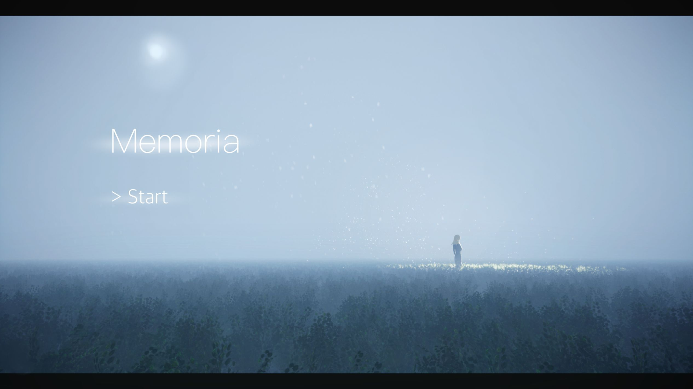

# Memoria


In this game, you take on the role of Jerome as you explore his mysterious past and unravel the truth behind his memories. The story begins as you enter a dark and shadowy house that was once Jerome's home with his lover, Maria. However, after their breakup three years ago, Maria died in secret and Jerome suffered a car accident a year ago that caused him to lose his memory. Now, Jerome must collect photo fragments to piece together his memories of Maria and ultimately decide the truth behind her death. As you guide Jerome through his past, the choices you make will determine the outcome of the game, leading to one of three different endings.

## Poster

You can get a glimpse of the eerie atmosphere of the game and the memories that Jerome is trying to piece together through our poster. Check it out [here](https://focs.ji.sjtu.edu.cn/silverfocs/demo/2021/p2team4/doc/poster.pdf).

## Trailer

To give you a taste of what the game is all about, check out our trailer video below.

[Click here to watch the trailer](doc/trailer.mp4)

## How to play the game

To play the game, explore the house carefully and interact with objects using the mouse. Check the furniture on different floors and look for unusual things like fragmented pictures, fresh coffee, a dark second floor, and a locked drawer. Search inch-by-inch and find keys or fragments to unlock secrets. Solving puzzles can change the scene and reveal useful items. Pay attention to short words found and consider the furniture in the house. Make choices during the first visit to a memory, as they are final. Once choices are made, they can't be changed. Ultimately, reach one of the three different endings.

For more information, please read through the [booklet](https://focs.ji.sjtu.edu.cn/silverfocs/demo/2021/p2team4/doc/booklet.pdf).

## Getting Started

The game is available [online](https://focs.ji.sjtu.edu.cn/silverfocs/demo/2021/p2team4/). You can also run the game locally by following the instructions below.

To run the project, you will need to have Elm installed on your system. You can install it by following the instructions on the official Elm website: https://guide.elm-lang.org/install/elm.html

1. Clone the repository

2. Compile the project:

```
elm make src/main.elm
```

3. Run the HTML file generated by the compiler

## Awards

- **Best Presentation** - [JI 2021 Summer Design Expo](https://www.ji.sjtu.edu.cn/news/campus-life/2021-08-05/126975/)
- **Best Artwork Design** - [SilverFOCS](https://focs.ji.sjtu.edu.cn/silverfocs/famewall/)

## Contributors

**Ocean Cat Studio**


Team member:

- Joven Laurens Nicholas
- TingTing Ding 丁婷婷
- Xu He 何煦
- YueWen Hou 侯悦文
